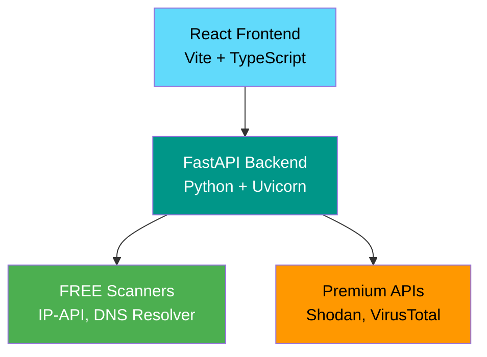

<div align="center">

# 🔒 ThreatLab 2.0

### 🚀 **The Ultimate Cybersecurity Learning Platform**

[](https://python.org)
[](https://reactjs.org)
[](https://fastapi.tiangolo.com/)
[](LICENSE)
[](https://github.com/HuzHacker123/ThreatLab/stargazers)

**Master cybersecurity through hands-on tools and real-world scenarios**

[🎯 Quick Start](#-quick-start) • [🛠️ Features](#-features) • [📚 Documentation](#-documentation) • [🤝 Contributing](#-contributing)

---

</div>

## ✨ What is ThreatLab?

**ThreatLab 2.0** is a cutting-edge cybersecurity education platform that transforms complex security concepts into interactive, hands-on learning experiences. Whether you're a beginner exploring the world of cybersecurity or a professional sharpening your skills, ThreatLab provides the tools you need to understand and combat digital threats.

### 🎯 **Why Choose ThreatLab?**

- **🆓 FREE Forever** - Core features work without any API keys or subscriptions
- **🔬 Hands-On Learning** - Real tools, real results, real education
- **🚀 Premium Power** - Optional upgrades for advanced capabilities
- **🛡️ Ethical Focus** - Built with security and responsibility in mind
- **📱 Modern Interface** - Beautiful, responsive web application

---

## 🚀 Quick Start

Get ThreatLab running in **5 minutes**! No API keys required.

### 📋 Prerequisites

- **Node.js 16+** - [Download here](https://nodejs.org/)
- **Python 3.8+** - [Download here](https://python.org/)
- **Git** - [Download here](https://git-scm.com/)

### ⚡ Installation

```bash
# 1. Clone the repository
git clone https://github.com/HuzHacker123/ThreatLab.git
cd ThreatLab

# 2. Install frontend dependencies
npm install

# 3. Setup backend
cd backend
pip install -r requirements.txt

# 4. Start the application
# Terminal 1 - Backend
python main.py

# Terminal 2 - Frontend (from project root)
cd .. && npm run dev
```

### 🎉 **You're Done!**

Open [**http://localhost:5174**](http://localhost:5174) in your browser and start exploring cybersecurity!

---

## 🛠️ Features

### 🔍 Network Scanner

Discover and analyze network infrastructure with professional-grade tools.

#### 🌟 FREE Features (No Setup Required)
- **🌍 IP Geolocation** - Geographic location, ISP, and organization data
- **🔎 DNS Resolution** - Domain to IP lookups with A, AAAA, MX, NS records
- **🔒 SSL Certificate Analysis** - Certificate validation and security details
- **⚡ Instant Results** - No waiting, no API keys, no limits

#### 💎 Premium Features (Shodan API)
- **🔌 Advanced Port Scanning** - Open ports and service detection
- **🛡️ Vulnerability Assessment** - Security vulnerability data
- **🏢 CIDR Range Scanning** - Subnet and network reconnaissance
- **📊 Historical Scan Data** - Device and service history

### 🛡️ Malware Scanner

Analyze suspicious files and understand malware behavior.

#### 🌟 FREE Features
- **🔐 File Hash Calculation** - MD5, SHA-1, SHA-256
- **📄 Basic File Analysis** - File type and metadata extraction

#### 💎 Premium Features (VirusTotal API)
- **🔬 90+ Antivirus Engines** - Comprehensive malware detection
- **⚡ Real-time Analysis** - Instant threat assessment
- **📋 Detailed Reports** - Comprehensive security analysis

---

## 📊 Feature Comparison

| Feature | 🌟 FREE | 💎 Premium (Shodan) | 💎 Premium (VirusTotal) |
|---------|--------|-------------------|----------------------|
| **IP Geolocation** | ✅ | ✅ | - |
| **DNS Lookup** | ✅ | ✅ | - |
| **SSL Analysis** | ✅ | ✅ | - |
| **Port Scanning** | ❌ | ✅ | - |
| **Service Detection** | ❌ | ✅ | - |
| **Vulnerability Data** | ❌ | ✅ | - |
| **Malware Scanning** | Basic | - | ✅ Full |
| **Setup Required** | None | API Key | API Key |
| **Rate Limits** | 1000/day | 100-1000/month | 500/day |

---

## 🔑 API Configuration (Optional)

Unlock premium features with optional API integrations.

### 🛡️ VirusTotal API (Malware Scanner)

```bash
# 1. Visit https://www.virustotal.com/
# 2. Create FREE account
# 3. Get API key from profile settings
# 4. Add to backend/.env
VIRUSTOTAL_API_KEY=your_virustotal_key_here
```

### 🔍 Shodan API (Network Scanner)

```bash
# 1. Visit https://www.shodan.io/member
# 2. Choose plan ($49/month basic)
# 3. Get API key from account settings
# 4. Add to backend/.env
SHODAN_API_KEY=your_shodan_key_here
```

---

## 🎮 How to Use

### Network Scanner
1. **Launch** ThreatLab at http://localhost:5174
2. **Navigate** to Network Scanner
3. **Choose** scan type:
   - **Host Information** 🌍 - IP geolocation (FREE)
   - **DNS Lookup** 🔎 - Domain resolution (FREE)
   - **SSL Analysis** 🔒 - Certificate check (FREE)
4. **Enter** target (IP address or domain)
5. **Click** "Start Scan" and explore results!

### Malware Scanner
1. **Open** Malware Scanner tab
2. **Upload** suspicious file
3. **View** instant analysis results
4. **Learn** from detailed security reports

---

## 🎯 Safe Testing Targets

### 🌐 Public Services (Safe to Scan)
- `8.8.8.8` - Google Public DNS
- `1.1.1.1` - Cloudflare DNS
- `google.com` - Popular domain
- `github.com` - Development platform

### 🏠 Your Network (With Permission)
- Router IP (usually `192.168.1.1`)
- ISP gateway
- Authorized lab networks

---

## ⚖️ Legal & Ethical Guidelines

### ✅ AUTHORIZED USE CASES
- 🎓 **Educational Learning** - Study cybersecurity concepts
- 🏠 **Personal Networks** - Your own home network
- 🧪 **Lab Environments** - Authorized testing environments
- 📝 **Professional Testing** - With written permission

### ❌ PROHIBITED ACTIVITIES
- 🚫 **Unauthorized Scanning** - Without explicit permission
- 🏛️ **Government Systems** - Critical infrastructure
- 💰 **Illegal Activities** - Any criminal violations

<div align="center">

## ⚠️ **IMPORTANT LEGAL NOTICE**

**Always obtain written permission before scanning any network or system!**

Unauthorized access may violate laws including the Computer Fraud and Abuse Act (CFAA), GDPR, and other regulations.

</div>

---

## 🏗️ Architecture



**Modern stack, maximum security, instant results.**

---

## 🔧 API Reference

### Network Scanning
```http
POST /api/scan
Content-Type: application/json

{
  "target": "8.8.8.8",
  "scan_type": "host"
}
```

### Malware Scanning
```http
POST /api/malware-scan
Content-Type: multipart/form-data

# File upload with 'file' field
```

### Health Check
```http
GET /
# Returns API status and version
```

---

## 🐛 Troubleshooting

### Backend Won't Start
```bash
# Kill existing process
lsof -ti:8000 | xargs kill -9

# Start fresh
cd backend && python main.py
```

### FREE Scans Not Working
- ✅ Check internet connection
- ✅ Verify target is valid IP/domain
- ✅ Some targets may not have public data

### Premium Features Unavailable
- 🔑 Verify API keys in `backend/.env`
- 💰 Check account credits/limits
- 🔄 Restart backend after key changes

---

## 📚 Learning Resources

### 🏆 Official Resources
- [**OWASP**](https://owasp.org/) - Web application security
- [**NIST Cybersecurity**](https://www.nist.gov/cyberframework)
- [**SANS Institute**](https://www.sans.org/) - Professional training

### 🎓 Free Learning Platforms
- [**Cybrary**](https://www.cybrary.it/) - Free cybersecurity courses
- [**HackTheBox**](https://www.hackthebox.com/) - Practice labs
- [**TryHackMe**](https://tryhackme.com/) - Guided challenges

### 📖 Books & Documentation
- **"Hacking: The Art of Exploitation"** by Jon Erickson
- **"The Web Application Hacker's Handbook"** by Dafydd Stuttard
- **OWASP Testing Guide**

---

## 🤝 Contributing

We welcome contributions from the cybersecurity community!

### How to Contribute
1. 🍴 **Fork** the repository
2. 🌿 **Create** feature branch: `git checkout -b feature/amazing-feature`
3. 💻 **Develop** your changes
4. 🧪 **Test** thoroughly
5. 📝 **Commit**: `git commit -m 'Add amazing feature'`
6. 🚀 **Push**: `git push origin feature/amazing-feature`
7. 🔄 **Submit** pull request

### Development Guidelines
- Follow ethical hacking principles
- Include comprehensive tests
- Update documentation
- Respect legal boundaries

---

## 📄 Project Structure

```
ThreatLab/
├── 📁 src/                    # React frontend
│   ├── 📁 components/        # Reusable UI components
│   ├── 📁 pages/            # Application pages
│   └── 📁 contexts/         # React state management
├── 📁 backend/               # FastAPI backend
│   ├── 📄 main.py          # API server & logic
│   ├── 📄 requirements.txt # Python dependencies
│   └── 📄 .env             # Environment variables
├── 📁 public/               # Static assets
├── 📄 package.json         # Node.js dependencies
├── 📄 tailwind.config.js   # Styling configuration
└── 📄 README.md           # Documentation (this file)
```

---

## 🙏 Acknowledgments

**ThreatLab** stands on the shoulders of amazing open-source projects:

- **FastAPI** - The fastest Python web framework
- **React** - Declarative UI library
- **Vite** - Lightning-fast build tool
- **Tailwind CSS** - Utility-first CSS framework
- **IP-API** - Free geolocation service
- **VirusTotal** - Industry-leading malware analysis
- **Shodan** - Internet search engine for devices

---

## 📞 Support & Community

- 🐛 **Bug Reports**: [GitHub Issues](https://github.com/HuzHacker123/ThreatLab/issues)
- 💬 **Discussions**: [GitHub Discussions](https://github.com/HuzHacker123/ThreatLab/discussions)
- 📧 **Security Issues**: Contact maintainers directly
- 📖 **Documentation**: This README and code comments

---

<div align="center">

## 🎉 **Ready to Start Your Cybersecurity Journey?**

**[🚀 Get Started Now](#-quick-start)**

**Built with ❤️ for the cybersecurity community**

---

**Remember: Knowledge is power, but with great power comes great responsibility.**

**Use ThreatLab ethically and legally!** 🛡️🔒

</div>